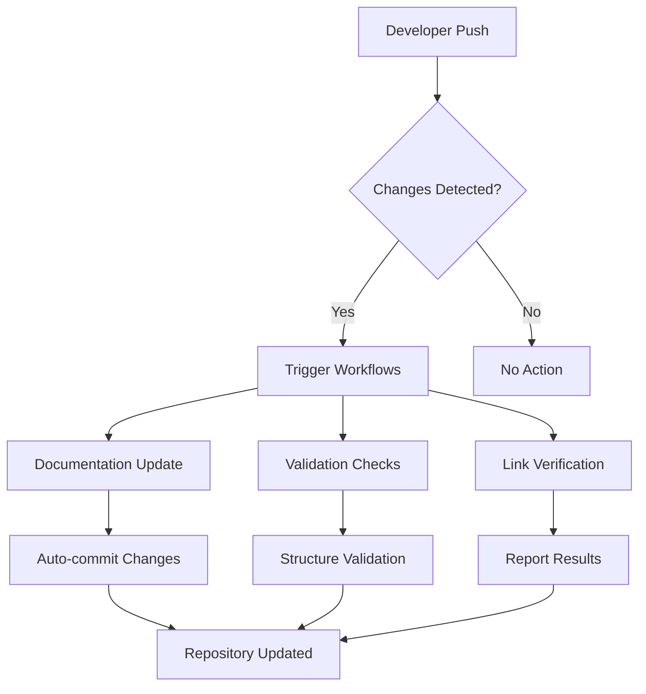

# 🚀 CI/CD Pipeline Documentation

[](https://github.com/features/actions)
[](https://github.com)
[](https://github.com)

This document provides a comprehensive overview of the Continuous Integration and Continuous Deployment (CI/CD) pipeline implemented for the LeetCode Problem Solutions repository.

## 📋 Table of Contents

- [Overview](#overview)
- [Pipeline Architecture](#pipeline-architecture)
- [Automated Workflows](#automated-workflows)
- [Scripts and Tools](#scripts-and-tools)
- [Documentation Auto-Update](#documentation-auto-update)
- [Manual Triggers](#manual-triggers)
- [Configuration](#configuration)
- [Troubleshooting](#troubleshooting)
- [Contributing to CI/CD](#contributing-to-cicd)

## 🎯 Overview

The CI/CD pipeline automatically maintains repository documentation, validates problem structures, and ensures consistency across all programming languages and problem categories. The system is designed to:

- **Automatically detect** new problem additions
- **Update documentation** files when changes occur
- **Validate** problem structure and metadata
- **Maintain consistency** across multiple languages
- **Provide quality assurance** for all contributions

## 🏗️ Pipeline Architecture



## 🔄 Automated Workflows

### 1. Documentation Auto-Update Workflow

**File**: `.github/workflows/auto-update-docs.yml`

**Triggers**:
- Push to `main`/`master` branch with problem directory changes
- Pull requests affecting problem directories
- Manual workflow dispatch

**Process**:
1. **Problem Detection**: Scans for new or modified problem directories
2. **Metadata Extraction**: Reads problem titles, difficulties, topics, and languages
3. **Documentation Generation**: Updates all documentation files:
   - `README.md` - Repository overview and statistics
   - `INDEX.md` - Problem indices and categorization
   - `PERFORMANCE_ANALYSIS.md` - Performance metrics
   - `InterviewPreparation.md` - Interview references
4. **Auto-commit**: Commits updated documentation with descriptive messages

### 2. Documentation Validation Workflow

**File**: `.github/workflows/validate-docs.yml`

**Triggers**:
- All pushes and pull requests
- Scheduled runs (weekly)

**Validation Checks**:
- ✅ Problem directory structure
- ✅ Required file presence (`Problem.md`, solution files)
- ✅ Markdown syntax and formatting
- ✅ Internal link integrity
- ✅ Metadata consistency
- ✅ Code file syntax validation

### 3. Manual Update Workflow

**File**: `.github/workflows/manual-update.yml`

**Triggers**:
- Manual workflow dispatch
- Repository maintenance schedules

**Features**:
- Force update all documentation
- Rebuild indices and statistics
- Comprehensive validation sweep
- Performance analysis update

## 🛠️ Scripts and Tools

### Core Scripts

| Script | Purpose | Location |
|--------|---------|----------|
| `update_documentation.py` | Main documentation updater | `.github/scripts/` |
| `validate_documentation.py` | Documentation validator | `.github/scripts/` |
| `check_links.py` | Internal link checker | `.github/scripts/` |
| `validate_problems.py` | Problem structure validator | `.github/scripts/` |
| `manual_update.py` | Manual update interface | `.github/scripts/` |

### Documentation Updater Features

- **Smart Detection**: Only updates changed sections
- **Multi-language Support**: Handles C++, Java, Python, JavaScript, Rust
- **Performance Tracking**: Monitors solution efficiency
- **Statistics Generation**: Auto-calculates repository metrics
- **Error Handling**: Graceful handling of malformed data

## 📚 Documentation Auto-Update

### Supported Documentation Files

#### README.md
- Repository statistics and metrics
- Problem count by difficulty and language
- Recent additions and updates
- Getting started information

#### INDEX.md
- Categorized problem lists
- Difficulty-based organization
- Topic-based grouping
- Search-friendly formatting

#### PERFORMANCE_ANALYSIS.md
- Time/space complexity comparisons
- Language-specific performance metrics
- Optimization recommendations
- Benchmarking results

#### InterviewPreparation.md
- Interview-focused problem lists
- Company-specific problem collections
- Difficulty progression guides
- Study plan recommendations

### Update Process

```python
# Simplified update flow
def update_documentation():
    problems = scan_problem_directories()
    metadata = extract_problem_metadata(problems)
    
    update_readme(metadata)
    update_index(metadata)
    update_performance_analysis(metadata)
    update_interview_preparation(metadata)
    
    commit_changes("Auto-update documentation")
```

## 🎮 Manual Triggers

### GitHub Actions Interface

1. Navigate to **Actions** tab in the repository
2. Select **Manual Documentation Update** workflow
3. Click **Run workflow**
4. Choose branch (default: main)
5. Optionally specify update scope

### Command Line Interface

```bash
# Trigger via GitHub CLI
gh workflow run manual-update.yml

# With parameters
gh workflow run manual-update.yml -f force-rebuild=true
```

### Local Development

```bash
# Run documentation update locally
cd .github/scripts
python update_documentation.py

# Validate changes
python validate_documentation.py
```

## ⚙️ Configuration

### Workflow Configuration

```yaml
# .github/workflows/auto-update-docs.yml
name: Auto-Update Documentation
on:
  push:
    branches: [main, master]
    paths: 
      - 'Daily_Problems/**'
      - 'Regular_Practice_Problems/**'
      - 'Rgegular_Practice_Problems/**'
  pull_request:
    paths:
      - 'Daily_Problems/**'
      - 'Regular_Practice_Problems/**'
      - 'Rgegular_Practice_Problems/**'
```

### Script Configuration

```python
# Configuration constants
SUPPORTED_LANGUAGES = ['C++', 'Java', 'Python', 'JavaScript', 'Rust', 'C']
REQUIRED_PATTERNS = {
    'difficulty': r'\*\*Difficulty\*\*:\s*(\w+)',
    'title': r'#\s*\d+\.',
    'topics': r'\*\*Topics\*\*:'
}
```

## 🔧 Troubleshooting

### Common Issues

#### Documentation Not Updating
- **Check**: Workflow triggers in `.github/workflows/`
- **Verify**: Problem directory structure
- **Ensure**: Required metadata patterns exist

#### Validation Failures
- **Problem.md**: Must contain required patterns
- **Solution Files**: At least one solution file required
- **Metadata**: Title must include problem number

#### Performance Issues
- **Large Repositories**: Consider incremental updates
- **Rate Limits**: GitHub API rate limiting may affect updates
- **File Conflicts**: Manual merge may be required

### Debug Commands

```bash
# Check workflow status
gh run list --workflow=auto-update-docs.yml

# View workflow logs
gh run view <run-id>

# Test scripts locally
python .github/scripts/update_documentation.py --debug
```

## 🤝 Contributing to CI/CD

### Adding New Workflows

1. Create workflow file in `.github/workflows/`
2. Define appropriate triggers
3. Add comprehensive error handling
4. Include logging and notifications
5. Test with various scenarios

### Improving Scripts

1. Follow Python best practices
2. Add comprehensive error handling
3. Include unit tests
4. Document all functions
5. Consider performance implications

### Workflow Enhancement Ideas

- **Multi-language Testing**: Automated code compilation/execution
- **Performance Benchmarking**: Automated performance testing
- **Security Scanning**: Code security analysis
- **Quality Metrics**: Code quality assessment
- **Notification System**: Enhanced status notifications

## 📊 Monitoring and Analytics

### Workflow Metrics
- Success/failure rates
- Execution times
- Resource usage
- Error patterns

### Documentation Health
- Update frequency
- Coverage completeness
- Link integrity
- Formatting consistency

## 🚀 Future Enhancements

### Planned Features
- [ ] Automated performance benchmarking
- [ ] Multi-repository synchronization
- [ ] Enhanced notification system
- [ ] Custom quality gates
- [ ] Integration with external tools

### Advanced Automation
- [ ] AI-powered code review
- [ ] Automated test generation
- [ ] Smart problem categorization
- [ ] Performance optimization suggestions

---

## 📞 Support

For CI/CD related issues:
1. Check the [Troubleshooting](#troubleshooting) section
2. Review workflow logs in GitHub Actions
3. Create an issue with the `ci/cd` label
4. Consult the `.github/README.md` for technical details

---

⚡ **Powered by GitHub Actions** | 🔄 **Always Up-to-Date** | 📈 **Continuously Improving**
