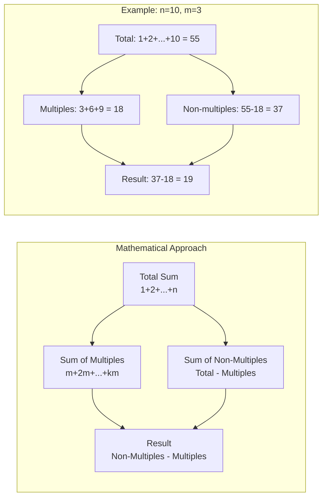

# LeetCode 2894: Divisible and Non-divisible Sums Difference

## Problem Statement

You are given positive integers `n` and `m`.

Define two integers as follows:

- `num1`: The sum of all integers in the range [1, n] (both inclusive) that are **not divisible** by `m`.
- `num2`: The sum of all integers in the range [1, n] (both inclusive) that **are divisible** by `m`.

Return the integer `num1 - num2`.

### Constraints

- `1 <= n, m <= 1000`

## Examples

### Example 1

```
Input: n = 10, m = 3
Output: 19
Explanation:
- Integers not divisible by 3: [1,2,4,5,7,8,10], sum = 37
- Integers divisible by 3: [3,6,9], sum = 18
- Result: 37 - 18 = 19
```

### Example 2

```
Input: n = 5, m = 6
Output: 15
Explanation:
- Integers not divisible by 6: [1,2,3,4,5], sum = 15
- Integers divisible by 6: [], sum = 0
- Result: 15 - 0 = 15
```

### Example 3

```
Input: n = 5, m = 1
Output: -15
Explanation:
- Integers not divisible by 1: [], sum = 0
- Integers divisible by 1: [1,2,3,4,5], sum = 15
- Result: 0 - 15 = -15
```

## Solution Approaches

### Algorithm Visualization

```mermaid
flowchart TD
    A[Start: n, m] --> B{Choose Approach}
    B -->|Brute Force| C[Iterate 1 to n]
    B -->|Mathematical| D[Use Formulas]

    C --> C1{For each i}
    C1 --> C2{i % m == 0?}
    C2 -->|Yes| C3[Add to num2]
    C2 -->|No| C4[Add to num1]
    C3 --> C5{More numbers?}
    C4 --> C5
    C5 -->|Yes| C1
    C5 -->|No| C6[Return num1 - num2]

    D --> D1[Total sum = n × (n + 1) / 2]
    D1 --> D2[Multiples count = ⌊n / m⌋]
    D2 --> D3[Sum of multiples = m × count × (count + 1) / 2]
    D3 --> D4[Return total - 2 × multiples]

    style A fill:#e1f5fe
    style C6 fill:#c8e6c9
    style D4 fill:#c8e6c9
    style D fill:#fff3e0
    style C fill:#ffebee
```



### Approach 1: Brute Force

**Algorithm:**

1. Iterate through all numbers from 1 to n
2. For each number, check if it's divisible by m
3. Add to appropriate sum (num1 or num2)
4. Return num1 - num2

**Time Complexity:** O(n)
**Space Complexity:** O(1)

```cpp
int differenceOfSums_BruteForce(int n, int m) {
    int num1 = 0; // sum of numbers not divisible by m
    int num2 = 0; // sum of numbers divisible by m

    for (int i = 1; i <= n; i++) {
        if (i % m == 0) {
            num2 += i;
        } else {
            num1 += i;
        }
    }

    return num1 - num2;
}
```

### Approach 2: Mathematical Formula (Optimal)

**Key Insights:**

1. Total sum of numbers from 1 to n = n × (n + 1) / 2
2. Numbers divisible by m in range [1, n]: m, 2m, 3m, ..., km where k = ⌊n/m⌋
3. Sum of multiples = m × (1 + 2 + 3 + ... + k) = m × k × (k + 1) / 2
4. Sum of non-multiples = Total sum - Sum of multiples

**Algorithm:**

1. Calculate total sum using arithmetic series formula
2. Find count of multiples of m in range [1, n]
3. Calculate sum of multiples using arithmetic series formula
4. Calculate sum of non-multiples
5. Return difference

**Time Complexity:** O(1)
**Space Complexity:** O(1)

```cpp
int differenceOfSums(int n, int m) {
    // Total sum of numbers from 1 to n
    int totalSum = n * (n + 1) / 2;

    // Number of multiples of m in range [1, n]
    int multiplesCount = n / m;

    // Sum of multiples of m
    int num2 = m * multiplesCount * (multiplesCount + 1) / 2;

    // Sum of non-multiples
    int num1 = totalSum - num2;

    return num1 - num2;
}
```

### Approach 3: Alternative Mathematical Formula

**Even more direct approach:**
Since num1 = totalSum - num2, we have:
num1 - num2 = (totalSum - num2) - num2 = totalSum - 2 × num2

```cpp
int differenceOfSums_Alternative(int n, int m) {
    int totalSum = n * (n + 1) / 2;
    int multiplesCount = n / m;
    int sumOfMultiples = m * multiplesCount * (multiplesCount + 1) / 2;

    return totalSum - 2 * sumOfMultiples;
}
```

## LeetCode Solution Format

```cpp
class Solution {
public:
    int differenceOfSums(int n, int m) {
        // Total sum of numbers from 1 to n
        int totalSum = n * (n + 1) / 2;

        // Number of multiples of m in range [1, n]
        int multiplesCount = n / m;

        // Sum of multiples of m using arithmetic series formula
        int sumOfMultiples = m * multiplesCount * (multiplesCount + 1) / 2;

        // Return total sum - 2 * sum of multiples
        // Since num1 = totalSum - sumOfMultiples and num2 = sumOfMultiples
        // Result = num1 - num2 = (totalSum - sumOfMultiples) - sumOfMultiples
        return totalSum - 2 * sumOfMultiples;
    }
};
```

**Alternative Clean Version:**

```cpp
class Solution {
public:
    int differenceOfSums(int n, int m) {
        int totalSum = n * (n + 1) / 2;
        int k = n / m;
        int sumOfMultiples = m * k * (k + 1) / 2;
        return totalSum - 2 * sumOfMultiples;
    }
};
```

## LeetCode Submission Formats for All Languages

### C++ Solution

```cpp
class Solution {
public:
    int differenceOfSums(int n, int m) {
        int totalSum = n * (n + 1) / 2;
        int k = n / m;
        int sumOfMultiples = m * k * (k + 1) / 2;
        return totalSum - 2 * sumOfMultiples;
    }
};
```

### Java Solution

```java
class Solution {
    public int differenceOfSums(int n, int m) {
        int totalSum = n * (n + 1) / 2;
        int multiplesCount = n / m;
        int sumOfMultiples = m * multiplesCount * (multiplesCount + 1) / 2;
        return totalSum - 2 * sumOfMultiples;
    }
}
```

### Python Solution

```python
class Solution:
    def differenceOfSums(self, n: int, m: int) -> int:
        total_sum = n * (n + 1) // 2
        multiples_count = n // m
        sum_of_multiples = m * multiples_count * (multiples_count + 1) // 2
        return total_sum - 2 * sum_of_multiples
```

### JavaScript Solution

```javascript
/**
 * @param {number} n
 * @param {number} m
 * @return {number}
 */
var differenceOfSums = function(n, m) {
    const totalSum = n * (n + 1) / 2;
    const multiplesCount = Math.floor(n / m);
    const sumOfMultiples = m * multiplesCount * (multiplesCount + 1) / 2;
    return totalSum - 2 * sumOfMultiples;
};
```

### Rust Solution

```rust
impl Solution {
    pub fn difference_of_sums(n: i32, m: i32) -> i32 {
        let total_sum = n * (n + 1) / 2;
        let multiples_count = n / m;
        let sum_of_multiples = m * multiples_count * (multiples_count + 1) / 2;
        total_sum - 2 * sum_of_multiples
    }
}
```

## Language-Specific Implementation Notes

### C++

- Uses `int` for all variables (sufficient for given constraints)
- Manual memory management (stack allocation only for this problem)
- Fastest execution due to direct compilation to machine code

### Java

- Uses `int` primitive type
- Automatic garbage collection
- JIT compilation provides good performance
- Platform independent bytecode

### Python

- Uses `//` for integer division to ensure integer results
- Type hints (`int`) for better code documentation
- Dynamic typing allows flexible usage
- Interpreted language but highly optimized for mathematical operations

### JavaScript

- Uses `Math.floor()` for integer division
- `const` for immutable variables
- Works in both browser and Node.js environments
- V8 engine provides excellent optimization

### Rust

- Uses `i32` for explicit 32-bit signed integers
- Memory safety guaranteed at compile time
- Zero-cost abstractions
- Excellent performance with safety guarantees
- `snake_case` naming convention for function names

## Cross-Language Performance Comparison

| Language | Time Complexity | Space Complexity | Execution Speed | Memory Safety |
|----------|----------------|------------------|-----------------|---------------|
| C++ | O(1) | O(1) | ⭐⭐⭐⭐⭐ | Manual |
| Rust | O(1) | O(1) | ⭐⭐⭐⭐⭐ | Compile-time |
| Java | O(1) | O(1) | ⭐⭐⭐⭐ | Runtime (GC) |
| JavaScript | O(1) | O(1) | ⭐⭐⭐ | Runtime (GC) |
| Python | O(1) | O(1) | ⭐⭐ | Runtime (GC) |

## Algorithm Consistency Across Languages

All implementations use the identical mathematical approach:

1. **Calculate total sum**: `n × (n + 1) / 2`
2. **Find multiples count**: `⌊n / m⌋`
3. **Calculate sum of multiples**: `m × count × (count + 1) / 2`
4. **Return difference**: `total_sum - 2 × sum_of_multiples`

The formula `total_sum - 2 × sum_of_multiples` works because:

- `num1 = total_sum - sum_of_multiples`
- `num2 = sum_of_multiples`
- `num1 - num2 = (total_sum - sum_of_multiples) - sum_of_multiples = total_sum - 2 × sum_of_multiples`

## Complexity Analysis

| Approach | Time Complexity | Space Complexity | Notes |
|----------|----------------|------------------|-------|
| Brute Force | O(n) | O(1) | Simple but slower for large n |
| Mathematical | O(1) | O(1) | Optimal solution using formulas |
| Alternative Math | O(1) | O(1) | Most direct calculation |

## Edge Cases

1. **m > n:** No multiples exist, so num2 = 0, num1 = total sum
2. **m = 1:** All numbers are divisible by 1, so num1 = 0
3. **n = 1:** Only one number to consider
4. **n = m:** Exactly one multiple exists

## Implementation Tips

1. **Integer Overflow:** For the given constraints (n, m ≤ 1000), integer overflow is not a concern
2. **Division:** Use integer division (n / m) to get the count of multiples
3. **Testing:** Include edge cases in your test suite

## Test Cases

```cpp
// Basic examples
assert(differenceOfSums(10, 3) == 19);
assert(differenceOfSums(5, 6) == 15);
assert(differenceOfSums(5, 1) == -15);

// Edge cases
assert(differenceOfSums(1, 2) == 1);
assert(differenceOfSums(4, 2) == -2);
assert(differenceOfSums(1000, 7) == 84735);
```

## Related Problems

- **LeetCode 412:** Fizz Buzz (divisibility checking)
- **LeetCode 204:** Count Primes (number theory)
- **LeetCode 202:** Happy Number (mathematical calculations)

## Key Takeaways

1. **Pattern Recognition:** Look for mathematical patterns that can simplify brute force solutions
2. **Arithmetic Series:** Understanding sum formulas can lead to O(1) solutions
3. **Complement Thinking:** Instead of calculating both sums separately, use total sum and one subset
4. **Edge Case Handling:** Always consider boundary conditions in mathematical problems

## Performance Comparison

For n = 1000:

- **Brute Force:** 1000 iterations, 1000 modulo operations
- **Mathematical:** 3 arithmetic operations

The mathematical approach is significantly faster and more elegant, especially for larger inputs within the constraint range.
