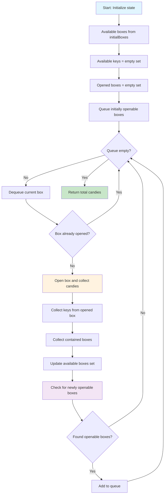
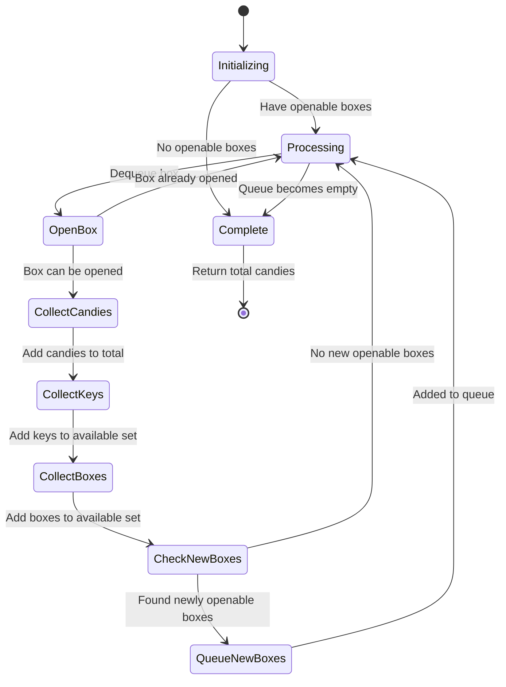
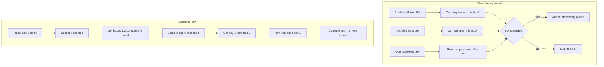

# LeetCode 1298: Maximum Candies You Can Get from Boxes

## Problem Analysis

This is a **Hard** problem that involves:

- Graph traversal (BFS/DFS)
- State management (boxes, keys, opened status)
- Simulation of box opening process
- Set operations for tracking available resources

**Core Challenge**: Maximize candy collection by strategically opening boxes when keys become available.

## Solution Approaches

### Algorithm Visualization







### Approach 1: BFS Simulation (Optimal)

**Core Insight**:

- Treat this as a graph traversal problem where boxes are nodes
- Use BFS to process boxes as they become available
- Track: available boxes, collected keys, opened boxes
- Continue until no more boxes can be opened

**Algorithm Steps**:

1. **Initialize state**: Track available boxes, keys, and opened status
2. **BFS Processing**: Process boxes that can be opened (available + key/open)
3. **State Updates**: Collect candies, keys, and new boxes from each opened box
4. **Termination**: When no more boxes can be opened
5. **Return**: Total candies collected

**Time Complexity**: O(n) - each box processed at most once
**Space Complexity**: O(n) - for tracking state

### Approach 2: DFS with Memoization

**Alternative approach using DFS**:

- Recursively try to open each available box
- Use memoization to avoid reprocessing states
- Similar complexity but different traversal order

### Approach 3: Iterative Simulation

**Direct simulation without explicit queue**:

- Repeatedly scan for newly openable boxes
- Continue until no changes in state
- Simpler to implement but potentially less efficient

## Mathematical Analysis

**Key Observations**:

1. Each box can be opened at most once
2. Order of opening doesn't affect total candies (only availability matters)
3. Need both possession and access (key or initially open) to open a box
4. Maximum possible candies = sum of all reachable boxes

**State Space**:

- Boxes we possess: up to n boxes
- Keys we have: up to n different keys
- Total states: manageable due to monotonic progress

## Implementation Strategy

### Data Structures Needed

1. **Queue/Set**: For BFS traversal of available boxes
2. **Set**: Track keys collected
3. **Set**: Track boxes we possess
4. **Boolean Array**: Track which boxes have been opened
5. **Integer**: Running total of candies

### Core Algorithm Loop

```
while (can open more boxes):
    for each box we can open:
        collect candies
        collect keys
        collect contained boxes
        mark as opened
    update available boxes
```

## Edge Cases

1. **No initial boxes**: Return 0
2. **All boxes initially closed with no keys**: Limited by initial open boxes
3. **Circular dependencies**: Box A needs key from Box B, Box B needs key from Box A
4. **Self-containing boxes**: Box contains itself (should be handled gracefully)
5. **Duplicate keys**: Multiple keys for same box (no additional benefit)

## Step-by-Step Example

**Input**: `status = [1,0,1,0]`, `candies = [7,5,4,100]`, `keys = [[],[],[1],[]]`, `containedBoxes = [[1,2],[3],[],[]]`, `initialBoxes = [0]`

**Step 1**: Start with box 0

- Box 0 is open (status[0] = 1)
- Collect 7 candies
- Get boxes 1, 2 from containedBoxes[0]
- No new keys from keys[0]
- Total candies: 7

**Step 2**: Available boxes: {1, 2}

- Box 1: closed, no key → skip
- Box 2: open (status[2] = 1) → process
- Collect 4 candies, get key 1, no new boxes
- Total candies: 7 + 4 = 11

**Step 3**: Now have key 1, can open box 1

- Collect 5 candies, get box 3, no new keys
- Total candies: 11 + 5 = 16

**Step 4**: Box 3 available but closed, no key 3

- Cannot open box 3
- Final total: 16

## Common Pitfalls

1. **State Management**: Forgetting to track which boxes we possess vs. which we can open
2. **Key Collection**: Not properly updating available keys after opening boxes
3. **Termination**: Infinite loops when not detecting no-progress state
4. **Duplicate Processing**: Opening same box multiple times
5. **Index Bounds**: Accessing invalid box indices from containedBoxes

## Optimization Techniques

1. **Early Termination**: Stop when no boxes can be opened
2. **Set Operations**: Use hash sets for O(1) lookups
3. **State Compression**: Combine related state checks
4. **Lazy Evaluation**: Only check openability when state changes

## LeetCode Solution Formats

### C++ Solution

```cpp
class Solution {
public:
    int maxCandies(vector<int>& status, vector<int>& candies, vector<vector<int>>& keys,
                   vector<vector<int>>& containedBoxes, vector<int>& initialBoxes) {
        unordered_set<int> availableBoxes(initialBoxes.begin(), initialBoxes.end());
        unordered_set<int> availableKeys;
        unordered_set<int> openedBoxes;
        int totalCandies = 0;

        queue<int> toProcess;

        // Add initially openable boxes to queue
        for (int box : initialBoxes) {
            if (status[box] == 1) {
                toProcess.push(box);
            }
        }

        while (!toProcess.empty()) {
            int currentBox = toProcess.front();
            toProcess.pop();

            if (openedBoxes.count(currentBox)) continue;

            // Open the box
            openedBoxes.insert(currentBox);
            totalCandies += candies[currentBox];

            // Collect keys
            for (int key : keys[currentBox]) {
                availableKeys.insert(key);
            }

            // Collect contained boxes
            for (int box : containedBoxes[currentBox]) {
                availableBoxes.insert(box);
            }

            // Check for newly openable boxes
            for (int box : availableBoxes) {
                if (!openedBoxes.count(box) &&
                    (status[box] == 1 || availableKeys.count(box))) {
                    toProcess.push(box);
                }
            }
        }

        return totalCandies;
    }
};
```

### Java Solution

```java
class Solution {
    public int maxCandies(int[] status, int[] candies, int[][] keys,
                         int[][] containedBoxes, int[] initialBoxes) {
        Set<Integer> availableBoxes = new HashSet<>();
        Set<Integer> availableKeys = new HashSet<>();
        Set<Integer> openedBoxes = new HashSet<>();
        Queue<Integer> toProcess = new LinkedList<>();

        // Initialize with initial boxes
        for (int box : initialBoxes) {
            availableBoxes.add(box);
            if (status[box] == 1) {
                toProcess.offer(box);
            }
        }

        int totalCandies = 0;

        while (!toProcess.isEmpty()) {
            int currentBox = toProcess.poll();

            if (openedBoxes.contains(currentBox)) continue;

            // Open box and collect candies
            openedBoxes.add(currentBox);
            totalCandies += candies[currentBox];

            // Collect keys
            for (int key : keys[currentBox]) {
                availableKeys.add(key);
            }

            // Collect contained boxes
            for (int box : containedBoxes[currentBox]) {
                availableBoxes.add(box);
            }

            // Check for newly openable boxes
            for (int box : availableBoxes) {
                if (!openedBoxes.contains(box) &&
                    (status[box] == 1 || availableKeys.contains(box))) {
                    toProcess.offer(box);
                }
            }
        }

        return totalCandies;
    }
}
```

### Python Solution

```python
class Solution:
    def maxCandies(self, status: List[int], candies: List[int], keys: List[List[int]],
                   containedBoxes: List[List[int]], initialBoxes: List[int]) -> int:
        from collections import deque

        available_boxes = set(initialBoxes)
        available_keys = set()
        opened_boxes = set()
        to_process = deque()

        # Add initially openable boxes
        for box in initialBoxes:
            if status[box] == 1:
                to_process.append(box)

        total_candies = 0

        while to_process:
            current_box = to_process.popleft()

            if current_box in opened_boxes:
                continue

            # Open box and collect candies
            opened_boxes.add(current_box)
            total_candies += candies[current_box]

            # Collect keys
            for key in keys[current_box]:
                available_keys.add(key)

            # Collect contained boxes
            for box in containedBoxes[current_box]:
                available_boxes.add(box)

            # Check for newly openable boxes
            for box in available_boxes:
                if (box not in opened_boxes and
                    (status[box] == 1 or box in available_keys)):
                    to_process.append(box)

        return total_candies
```

### JavaScript Solution

```javascript
/**
 * @param {number[]} status
 * @param {number[]} candies
 * @param {number[][]} keys
 * @param {number[][]} containedBoxes
 * @param {number[]} initialBoxes
 * @return {number}
 */
var maxCandies = function(status, candies, keys, containedBoxes, initialBoxes) {
    const availableBoxes = new Set(initialBoxes);
    const availableKeys = new Set();
    const openedBoxes = new Set();
    const toProcess = [];

    // Add initially openable boxes
    for (const box of initialBoxes) {
        if (status[box] === 1) {
            toProcess.push(box);
        }
    }

    let totalCandies = 0;

    while (toProcess.length > 0) {
        const currentBox = toProcess.shift();

        if (openedBoxes.has(currentBox)) continue;

        // Open box and collect candies
        openedBoxes.add(currentBox);
        totalCandies += candies[currentBox];

        // Collect keys
        for (const key of keys[currentBox]) {
            availableKeys.add(key);
        }

        // Collect contained boxes
        for (const box of containedBoxes[currentBox]) {
            availableBoxes.add(box);
        }

        // Check for newly openable boxes
        for (const box of availableBoxes) {
            if (!openedBoxes.has(box) &&
                (status[box] === 1 || availableKeys.has(box))) {
                toProcess.push(box);
            }
        }
    }

    return totalCandies;
};
```

### Rust Solution

```rust
use std::collections::{HashSet, VecDeque};

impl Solution {
    pub fn max_candies(status: Vec<i32>, candies: Vec<i32>, keys: Vec<Vec<i32>>,
                      contained_boxes: Vec<Vec<i32>>, initial_boxes: Vec<i32>) -> i32 {
        let mut available_boxes: HashSet<i32> = initial_boxes.iter().cloned().collect();
        let mut available_keys = HashSet::new();
        let mut opened_boxes = HashSet::new();
        let mut to_process = VecDeque::new();

        // Add initially openable boxes
        for &box_id in &initial_boxes {
            if status[box_id as usize] == 1 {
                to_process.push_back(box_id);
            }
        }

        let mut total_candies = 0;

        while let Some(current_box) = to_process.pop_front() {
            if opened_boxes.contains(&current_box) {
                continue;
            }

            // Open box and collect candies
            opened_boxes.insert(current_box);
            total_candies += candies[current_box as usize];

            // Collect keys
            for &key in &keys[current_box as usize] {
                available_keys.insert(key);
            }

            // Collect contained boxes
            for &box_id in &contained_boxes[current_box as usize] {
                available_boxes.insert(box_id);
            }

            // Check for newly openable boxes
            for &box_id in &available_boxes {
                if !opened_boxes.contains(&box_id) &&
                   (status[box_id as usize] == 1 || available_keys.contains(&box_id)) {
                    to_process.push_back(box_id);
                }
            }
        }

        total_candies
    }
}
```

## Language-Specific Implementation Notes

### C++

- Uses `unordered_set` for O(1) average lookups
- `queue` for BFS traversal
- Range-based for loops for cleaner iteration
- Move semantics can be used for optimization

### Java

- `HashSet` and `LinkedList` from Collections framework
- Wrapper classes (Integer) for set operations
- Stream API can be used for functional programming style
- Memory management handled by garbage collector

### Python

- `set()` for hash set operations
- `deque` from collections for efficient queue operations
- List comprehensions can simplify some operations
- Type hints improve code readability

### JavaScript

- `Set` object for unique value collections
- `Array.shift()` for queue dequeue operation
- ES6+ features like destructuring can be used
- Automatic memory management

### Rust

- `HashSet` and `VecDeque` from standard collections
- Ownership system ensures memory safety
- Pattern matching with `if let` for queue operations
- Zero-cost abstractions for performance

## Cross-Language Performance Comparison

| Language | Time Complexity | Space Complexity | Execution Speed | Memory Safety |
|----------|----------------|------------------|-----------------|---------------|
| C++ | O(n) | O(n) | ⭐⭐⭐⭐⭐ | Manual |
| Rust | O(n) | O(n) | ⭐⭐⭐⭐⭐ | Compile-time |
| Java | O(n) | O(n) | ⭐⭐⭐⭐ | Runtime (GC) |
| JavaScript | O(n) | O(n) | ⭐⭐⭐ | Runtime (GC) |
| Python | O(n) | O(n) | ⭐⭐ | Runtime (GC) |

## Algorithm Consistency Across Languages

All implementations follow the same core algorithm:

1. **Initialize state tracking** (available boxes, keys, opened boxes)
2. **BFS traversal** using queue for processing openable boxes
3. **State updates** after opening each box (candies, keys, contained boxes)
4. **Termination** when no more boxes can be opened
5. **Return** total candies collected

## Complexity Analysis

| Approach | Time Complexity | Space Complexity | Notes |
|----------|----------------|------------------|-------|
| BFS Simulation | O(n) | O(n) | Each box processed once, sets for state tracking |
| DFS with Memo | O(n) | O(n) | Similar but different traversal order |
| Iterative Scan | O(n²) | O(n) | Less efficient due to repeated scanning |

Where n is the number of boxes.

## Test Cases

```cpp
// Example 1
status = [1,0,1,0], candies = [7,5,4,100], keys = [[],[],[1],[]],
containedBoxes = [[1,2],[3],[],[]], initialBoxes = [0]
Expected: 16

// Example 2
status = [1,0,0,0,0,0], candies = [1,1,1,1,1,1], keys = [[1,2,3,4,5],[],[],[],[],[]],
containedBoxes = [[1,2,3,4,5],[],[],[],[],[]], initialBoxes = [0]
Expected: 6

// Edge case: No initial boxes
initialBoxes = []
Expected: 0

// Edge case: All boxes closed, no keys
status = [0,0,0], candies = [1,2,3], keys = [[],[],[]],
containedBoxes = [[],[],[]], initialBoxes = [0,1,2]
Expected: 0
```

## Related Problems

- **LeetCode 200**: Number of Islands (BFS/DFS traversal)
- **LeetCode 127**: Word Ladder (BFS with state transitions)
- **LeetCode 752**: Open the Lock (BFS with constraints)
- **LeetCode 1091**: Shortest Path in Binary Matrix (BFS shortest path)

## Key Takeaways

1. **State Management**: Carefully track multiple types of state (possession, keys, opened status)
2. **BFS Pattern**: Use BFS when order doesn't matter but need to process all reachable states
3. **Set Operations**: Hash sets provide efficient membership testing and updates
4. **Termination Conditions**: Ensure algorithm terminates when no progress can be made
5. **Edge Case Handling**: Consider empty inputs and impossible scenarios

## Performance Optimization Tips

1. **Early Exit**: Stop processing when no new boxes can be opened
2. **Batch Processing**: Group state updates to minimize repeated checks
3. **Memory Pool**: Reuse data structures across test cases if applicable
4. **Bit Manipulation**: For small n, bit sets might be more efficient than hash sets

## Implementation Best Practices

1. **Clear Variable Names**: Use descriptive names for different types of state
2. **Function Decomposition**: Break down into smaller helper functions
3. **Input Validation**: Check for edge cases and invalid inputs
4. **Documentation**: Comment the algorithm flow and state transitions
5. **Testing**: Include comprehensive test cases covering all scenarios
