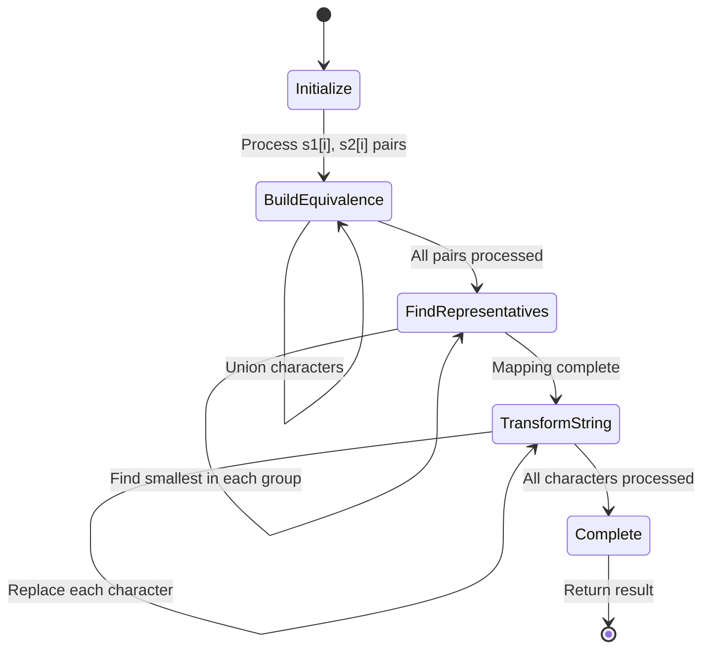

# LeetCode 1061: Lexicographically Smallest Equivalent String

## Problem Analysis

This is a **Medium** problem that involves:

- Union Find (Disjoint Set Union) data structure
- String manipulation and character equivalence
- Lexicographical ordering optimization
- Graph connectivity concepts

## Algorithm Visualization

```mermaid
flowchart TD
    A[Start: s1, s2, baseStr] --> B[Initialize Union Find Structure]
    B --> B1[parent[i] = i for all 26 characters<br/>Each character is its own parent initially]
    B1 --> C[Process Equivalence Pairs]
    C --> C1[For each i in s1.length]
    C1 --> C2[Union s1[i] and s2[i]]
    C2 --> C3{More pairs?}
    C3 -->|Yes| C1
    C3 -->|No| D[Find Lexicographical Representatives]
    
    D --> D1[For each character a-z]
    D1 --> D2[Find root of character's component]
    D2 --> D3[Find smallest character in component]
    D3 --> D4[Map character to smallest equivalent]
    D4 --> E{More characters?}
    E -->|Yes| D1
    E -->|No| F[Transform BaseStr]
    
    F --> F1[For each char in baseStr]
    F1 --> F2[Replace with mapped equivalent]
    F2 --> G{More characters?}
    G -->|Yes| F1
    G -->|No| H[Return Result String]
    
    style A fill:#e1f5fe
    style H fill:#c8e6c9
    style B fill:#fff3e0
    style D fill:#f3e5f5
```

```mermaid
graph TB
    subgraph "Union Find Operations"
        A1[Find(x)] --> B1{parent[x] == x?}
        B1 -->|Yes| C1[Return x]
        B1 -->|No| D1[parent[x] = Find(parent[x])]
        D1 --> E1[Return parent[x]]
        
        A2[Union(x, y)] --> B2[rootX = Find(x)]
        B2 --> C2[rootY = Find(y)]
        C2 --> D2{rootX != rootY?}
        D2 -->|Yes| E2[parent[max(rootX, rootY)] = min(rootX, rootY)]
        D2 -->|No| F2[Already connected]
    end
    
    subgraph "Example: s1='abc', s2='cde'"
        G1[Initial: a→a, b→b, c→c, d→d, e→e] --> H1[Union(a,c): a→a, c→a]
        H1 --> I1[Union(b,d): b→b, d→b]
        I1 --> J1[Union(c,e): c→a, e→a]
        J1 --> K1[Final groups: {a,c,e}, {b,d}]
    end
```



## Solution Approaches

### Approach 1: Union Find with Path Compression (Optimal)

**Core Insight**:

- Characters form equivalence classes through transitivity
- Use Union Find to efficiently manage these equivalence relationships
- For lexicographical optimality, always make the smaller character the root

**Algorithm Steps**:

1. **Initialize Union Find**: Each character is initially its own parent
2. **Process Equivalences**: Union corresponding characters from s1 and s2
3. **Find Representatives**: For each character, find the lexicographically smallest character in its component
4. **Transform Base String**: Replace each character with its representative

**Time Complexity**: O(α(26) × (|s1| + |baseStr|)) ≈ O(|s1| + |baseStr|)  
**Space Complexity**: O(26) = O(1)

### Approach 2: Graph-Based DFS (Alternative)

**Alternative approach using graph representation**:

- Build adjacency list of character equivalences
- Use DFS to find connected components
- Find minimum character in each component

**Time Complexity**: O(26 + |s1| + |baseStr|)  
**Space Complexity**: O(26 + |s1|)

### Mathematical Analysis

**Key Observations**:

1. Equivalence relation properties ensure transitivity
2. Union Find with path compression provides near-constant time operations
3. Lexicographical optimization requires careful root selection
4. Each character maps to exactly one representative

**Union Find Optimization**:

- **Path Compression**: Make each node point directly to root during Find
- **Union by Rank**: Not needed here since we prioritize lexicographical order
- **Weighted Union**: Modified to always prefer smaller character as root

## Implementation Details

### Key Data Structures

1. **Parent Array**: `parent[26]` where `parent[i]` points to parent of character `i`
2. **Character Mapping**: Direct indexing using `char - 'a'`
3. **Result String**: Built character by character from baseStr

### Union Find Operations

```cpp
class UnionFind {
    vector<int> parent;
public:
    UnionFind() : parent(26) {
        iota(parent.begin(), parent.end(), 0); // parent[i] = i
    }
    
    int find(int x) {
        if (parent[x] != x) {
            parent[x] = find(parent[x]); // Path compression
        }
        return parent[x];
    }
    
    void unite(int x, int y) {
        int rootX = find(x), rootY = find(y);
        if (rootX != rootY) {
            // Always make smaller character the root
            if (rootX < rootY) {
                parent[rootY] = rootX;
            } else {
                parent[rootX] = rootY;
            }
        }
    }
};
```

## Edge Cases

1. **No equivalences**: Each character maps to itself
2. **All characters equivalent**: All map to 'a'
3. **Empty baseStr**: Return empty string
4. **Single character**: Direct mapping
5. **Transitive chains**: a→b→c→d all become 'a'

## Step-by-Step Example

**Input**: `s1 = "parker"`, `s2 = "morris"`, `baseStr = "parser"`

**Step 1**: Initialize Union Find

```text
Initial: a→a, b→b, c→c, ..., z→z
```

**Step 2**: Process equivalence pairs

```text
Union(p,m): m→m, p→m (p becomes parent since p < m)
Union(a,o): a→a, o→a 
Union(r,r): No change (same character)
Union(k,r): k→k, r→k
Union(e,i): e→e, i→e
Union(r,s): r→k, s→k (r already points to k)
```

**Step 3**: Find representatives

```text
Groups: {m,p}→m, {a,o}→a, {k,r,s}→k, {e,i}→e
```

**Step 4**: Transform baseStr "parser"

```text
p → m, a → a, r → k, s → k, e → e, r → k
Result: "makkek"
```

## Common Pitfalls

1. **Root Selection**: Not ensuring lexicographically smaller character becomes root
2. **Path Compression**: Forgetting to implement path compression for efficiency
3. **Character Indexing**: Off-by-one errors in character to index conversion
4. **Equivalence Processing**: Missing the transitivity requirement
5. **Base Case**: Not handling characters that have no equivalences

## Optimization Techniques

1. **Path Compression**: Flatten tree structure during Find operations
2. **Lexicographical Union**: Always make smaller character the root
3. **Single Pass**: Build result string in one pass after preprocessing
4. **Early Termination**: Not applicable for this problem

## LeetCode Solution Formats

### C++ Solution

```cpp
class Solution {
private:
    vector<int> parent;
    
    int find(int x) {
        if (parent[x] != x) {
            parent[x] = find(parent[x]);
        }
        return parent[x];
    }
    
    void unite(int x, int y) {
        int rootX = find(x), rootY = find(y);
        if (rootX != rootY) {
            if (rootX < rootY) {
                parent[rootY] = rootX;
            } else {
                parent[rootX] = rootY;
            }
        }
    }
    
public:
    string smallestEquivalentString(string s1, string s2, string baseStr) {
        parent.resize(26);
        iota(parent.begin(), parent.end(), 0);
        
        // Build equivalence relationships
        for (int i = 0; i < s1.length(); i++) {
            unite(s1[i] - 'a', s2[i] - 'a');
        }
        
        // Transform baseStr
        string result;
        for (char c : baseStr) {
            result += char('a' + find(c - 'a'));
        }
        
        return result;
    }
};
```

### Java Solution

```java
class Solution {
    private int[] parent;
    
    private int find(int x) {
        if (parent[x] != x) {
            parent[x] = find(parent[x]);
        }
        return parent[x];
    }
    
    private void unite(int x, int y) {
        int rootX = find(x), rootY = find(y);
        if (rootX != rootY) {
            if (rootX < rootY) {
                parent[rootY] = rootX;
            } else {
                parent[rootX] = rootY;
            }
        }
    }
    
    public String smallestEquivalentString(String s1, String s2, String baseStr) {
        parent = new int[26];
        for (int i = 0; i < 26; i++) {
            parent[i] = i;
        }
        
        // Build equivalence relationships
        for (int i = 0; i < s1.length(); i++) {
            unite(s1.charAt(i) - 'a', s2.charAt(i) - 'a');
        }
        
        // Transform baseStr
        StringBuilder result = new StringBuilder();
        for (char c : baseStr.toCharArray()) {
            result.append((char)('a' + find(c - 'a')));
        }
        
        return result.toString();
    }
}
```

### Python Solution

```python
class Solution:
    def smallestEquivalentString(self, s1: str, s2: str, baseStr: str) -> str:
        parent = list(range(26))
        
        def find(x):
            if parent[x] != x:
                parent[x] = find(parent[x])
            return parent[x]
        
        def unite(x, y):
            rootX, rootY = find(x), find(y)
            if rootX != rootY:
                if rootX < rootY:
                    parent[rootY] = rootX
                else:
                    parent[rootX] = rootY
        
        # Build equivalence relationships
        for c1, c2 in zip(s1, s2):
            unite(ord(c1) - ord('a'), ord(c2) - ord('a'))
        
        # Transform baseStr
        result = []
        for c in baseStr:
            result.append(chr(ord('a') + find(ord(c) - ord('a'))))
        
        return ''.join(result)
```

### JavaScript Solution

```javascript
/**
 * @param {string} s1
 * @param {string} s2
 * @param {string} baseStr
 * @return {string}
 */
var smallestEquivalentString = function(s1, s2, baseStr) {
    const parent = Array.from({length: 26}, (_, i) => i);
    
    const find = (x) => {
        if (parent[x] !== x) {
            parent[x] = find(parent[x]);
        }
        return parent[x];
    };
    
    const unite = (x, y) => {
        const rootX = find(x), rootY = find(y);
        if (rootX !== rootY) {
            if (rootX < rootY) {
                parent[rootY] = rootX;
            } else {
                parent[rootX] = rootY;
            }
        }
    };
    
    // Build equivalence relationships
    for (let i = 0; i < s1.length; i++) {
        unite(s1.charCodeAt(i) - 97, s2.charCodeAt(i) - 97);
    }
    
    // Transform baseStr
    let result = '';
    for (const c of baseStr) {
        result += String.fromCharCode(97 + find(c.charCodeAt(0) - 97));
    }
    
    return result;
};
```

### Rust Solution

```rust
impl Solution {
    pub fn smallest_equivalent_string(s1: String, s2: String, base_str: String) -> String {
        let mut parent: Vec<usize> = (0..26).collect();
        
        fn find(parent: &mut Vec<usize>, x: usize) -> usize {
            if parent[x] != x {
                parent[x] = find(parent, parent[x]);
            }
            parent[x]
        }
        
        fn unite(parent: &mut Vec<usize>, x: usize, y: usize) {
            let root_x = find(parent, x);
            let root_y = find(parent, y);
            if root_x != root_y {
                if root_x < root_y {
                    parent[root_y] = root_x;
                } else {
                    parent[root_x] = root_y;
                }
            }
        }
        
        // Build equivalence relationships
        let s1_chars: Vec<char> = s1.chars().collect();
        let s2_chars: Vec<char> = s2.chars().collect();
        for i in 0..s1_chars.len() {
            let x = (s1_chars[i] as usize) - ('a' as usize);
            let y = (s2_chars[i] as usize) - ('a' as usize);
            unite(&mut parent, x, y);
        }
        
        // Transform baseStr
        base_str
            .chars()
            .map(|c| {
                let idx = (c as usize) - ('a' as usize);
                let root = find(&mut parent, idx);
                char::from(('a' as u8) + (root as u8))
            })
            .collect()
    }
}
```

## Language-Specific Implementation Notes

### C++

- Uses `iota` for efficient parent array initialization
- Range-based for loops for clean iteration
- String concatenation with `+=` operator
- `vector<int>` for parent array

### Java

- `StringBuilder` for efficient string building
- `charAt()` for character access
- Array initialization with explicit loop
- Character arithmetic with casting

### Python

- List comprehension for concise transformations
- `zip()` for parallel iteration
- `ord()` and `chr()` for character conversions
- Generator expressions for memory efficiency

### JavaScript

- `Array.from()` with mapping function for initialization
- `charCodeAt()` and `String.fromCharCode()` for character operations
- Template literals could be used for string building
- Arrow functions for concise function definitions

### Rust

- Vector with range collection for initialization
- Pattern matching and explicit type annotations
- `chars().collect()` for string to character vector conversion
- Iterator chains with `map()` and `collect()`

## Cross-Language Performance Comparison

| Language | Time Complexity | Space Complexity | Execution Speed | Memory Safety |
|----------|----------------|------------------|-----------------|---------------|
| C++ | O(α(26) × n) | O(1) | ⭐⭐⭐⭐⭐ | Manual |
| Rust | O(α(26) × n) | O(1) | ⭐⭐⭐⭐⭐ | Compile-time |
| Java | O(α(26) × n) | O(1) | ⭐⭐⭐⭐ | Runtime (GC) |
| JavaScript | O(α(26) × n) | O(1) | ⭐⭐⭐ | Runtime (GC) |
| Python | O(α(26) × n) | O(1) | ⭐⭐ | Runtime (GC) |

Where n = max(|s1|, |baseStr|) and α is the inverse Ackermann function.

## Algorithm Consistency Across Languages

All implementations follow the identical Union Find approach:

1. **Initialize parent array** with each character as its own parent
2. **Process equivalence pairs** using Union operation with lexicographical preference
3. **Apply path compression** in Find operation for efficiency
4. **Transform base string** by mapping each character to its representative

## Complexity Analysis

| Approach | Time Complexity | Space Complexity | Notes |
|----------|----------------|------------------|-------|
| Union Find | O(α(26) × n) | O(1) | Near-constant time per operation |
| DFS/BFS | O(26 + n) | O(26 + \|s1\|) | Graph traversal approach |
| Naive | O(26² × n) | O(1) | Repeated searches without optimization |

Where n = max(|s1|, |baseStr|).

## Test Cases

```cpp
// Example 1
s1 = "parker", s2 = "morris", baseStr = "parser"
Expected: "makkek"

// Example 2
s1 = "hello", s2 = "world", baseStr = "hold"
Expected: "hdld"

// Edge case: No equivalences
s1 = "aa", s2 = "aa", baseStr = "abc"
Expected: "abc"

// Edge case: All equivalent to 'a'
s1 = "abc", s2 = "aaa", baseStr = "zzz"
Expected: "aaa"
```

## Related Problems

- **LeetCode 200**: Number of Islands (Union Find application)
- **LeetCode 547**: Number of Provinces (Connected components)
- **LeetCode 684**: Redundant Connection (Union Find cycle detection)
- **LeetCode 990**: Satisfiability of Equality Equations (Similar equivalence relations)

## Key Takeaways

1. **Union Find Mastery**: Essential data structure for equivalence relations
2. **Path Compression**: Critical optimization for near-constant time operations
3. **Lexicographical Optimization**: Custom union strategy based on problem requirements
4. **Character Mapping**: Efficient indexing using ASCII arithmetic
5. **Transitivity Handling**: Union Find naturally handles transitive relationships

## Performance Optimization Tips

1. **Path Compression**: Always implement for optimal time complexity
2. **Union Strategy**: Customize union operation based on problem requirements
3. **Memory Efficiency**: Use fixed-size arrays for known character sets
4. **Single Pass**: Minimize iterations over input strings
5. **Early Initialization**: Set up data structures efficiently

## Implementation Best Practices

1. **Clear Function Names**: Use descriptive names for Union Find operations
2. **Error Handling**: Validate input constraints
3. **Documentation**: Comment the union strategy reasoning
4. **Testing**: Include edge cases in test suite
5. **Modularity**: Separate Union Find logic from string processing
